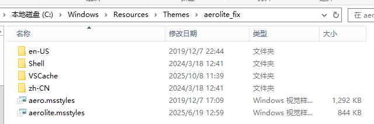
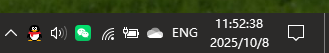
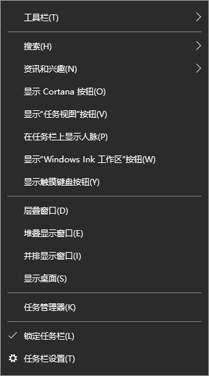
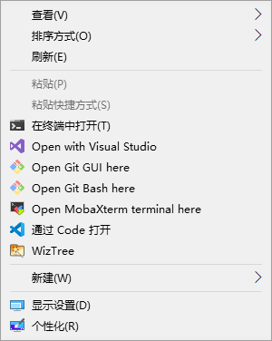

# aerolite-fix
some fixing to windows 10 aerolite.msstyle  
## use
> [!WARNING]
> this msstyle may only working in windows 10.

please put it with the aero.msstyle or it behave strange.  

## fixes
fix dark font in start bar when using dark theme.  
  
fix start bar right click meun does not show line seperates.(using window 10 style)  
  
fix desktop right click meun does not show line seperates.(using window 8.1 metro style)  

## issue
dark theme still have light components in exepolrer.exe  
strange transpant white lines everywhere.(such as notify center)  
